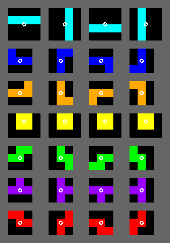
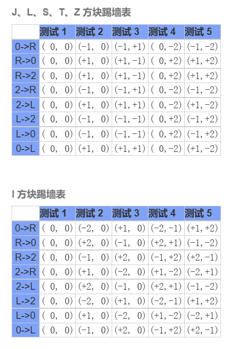
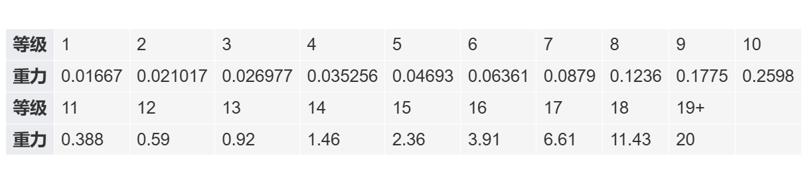

# 详细规则

---

## 旋转系统

采用 SRS 旋转系统，所有方块生成在第 22 行（与第 23 行）中央，不对称时靠左下生成。

各方块旋转中心如图所示：

踢墙表如图：

## 技术动作判定

### Spin

仅对 T-Spin 进行检测与奖励，具体检测规则如下：

1. 活动砖块为 T 块
2. 最后一步操作（HardDrop 除外）为旋转（自然下落与 SoftDrop 视为同种操作）
3. T 块的四角包含至少三个方块（墙壁或地板不属于方块）

#### T-Spin Mini

对 T-Spin Mini 的检测规则如下：

1. 满足 T-Spin 的检测条件
2. 未造成消除

T-Spin Mini 不进行奖励，会打断 Combo。

### Back to Back

简称 B2B，相邻的消除为四消 (QUAD) 或 T-Spin 的次数减一即 B2B 的奖励权重。

### Combo

连击，连续的消除次数 (包括 B2B 消除) 减一即 Combo 的奖励权重。

## 得分计算

仅在消除时产生得分，得分计算公式如下（使用 LaTeX 公式）：

$Score = 100\times\max((lines + B2B)\times(1 + 0.25\times Combo + T),\ AllClear)$

- $Score$ 表示当次消除得分
- $lines$ 表示当次消除的行数
- $B2B$ 表示连续 B2B 的次数
- $Combo$ 表示连击次数
- $T$ 表示是否为 T-Spin 消除
- $AllClear$ 表示全清奖励，为常量 $10$ 

## 各模式游戏规则

### 游戏结束规则

当且仅当新方块不能产生时游戏因堆叠中断。堆叠中断会导致任何游戏模式的结束。

部分游戏含有游戏目标，它们可能导致游戏正常结束：

- 40 行模式下有消行数上限 40 行，到达目标数后游戏会自动正常结束。
-   闪电战模式下游戏时长为 2 分钟，到达 2 分钟后游戏会自动正常结束。
-   多人模式下玩家的目标是击败除自己以外的所有玩家，达成目标后自动正常结束。
-   其他模式均无规定的结束目标，只能由堆叠中断触发游戏结束。

### 40 行模式规则

-   标准场地大小
-   在最短时间内消除 40 行以获得最高纪录
-   取得最高纪录的玩家为胜者
-   消除未满 40 行时若因堆叠中断而导致游戏结束，不产生得分记录
-   无垃圾行
-   重力为 0.0167
-   锁定延迟为 1 秒

### 闪电战模式

-   标准场地大小
-   在 2 分钟结束时的 Score 尽可能地高以获得最高纪录
-   取得最高纪录的玩家为胜者
-   游戏时常未达到 2 分钟时若因堆叠中断而导致游戏结束，不产生得分纪录
-   无垃圾行
-   重力为 0.07
-   锁定延迟为 0.5 秒

### 马拉松模式

-   标准场地大小
-   在游戏因堆叠中断时取得尽可能高的 Score 以获得最高纪录
-   取得最高纪录的玩家为胜者
-   无垃圾行
-   初始重力为 0.0167
-   初始锁定延迟为 1.0 秒
-   重力会随等级提升而增大，等级与重力的对应关系如下：

-	二十级之后重力不再增长
-	锁定延迟时间会随等级提升而缩短，前期锁定延迟时间与软降 (Soft Drop) 时间相同，最短可缩短到 0.25 秒

## 垃圾行生成规则

禅模式下，玩家消行打出的攻击力会由玩家在游戏开始前设定的垃圾行产生概率和伤害倍率计算伤害，伤害会返还给玩家自身。

多人模式则使用固定的垃圾行产生概率和伤害倍率来计算玩家受到的伤害量。

玩家受到的伤害量会自下而上地在右侧的伤害延迟记录条中加入，玩家的 combo 被打断后，记录中的伤害全部转换成垃圾行，自上而下地从右侧记录中读取添加行数并加入游戏底部。

